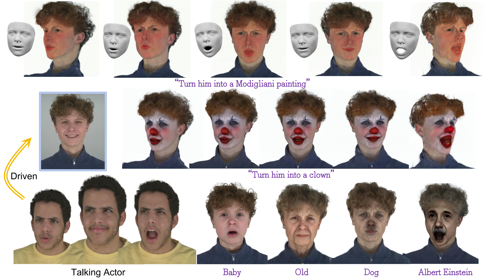
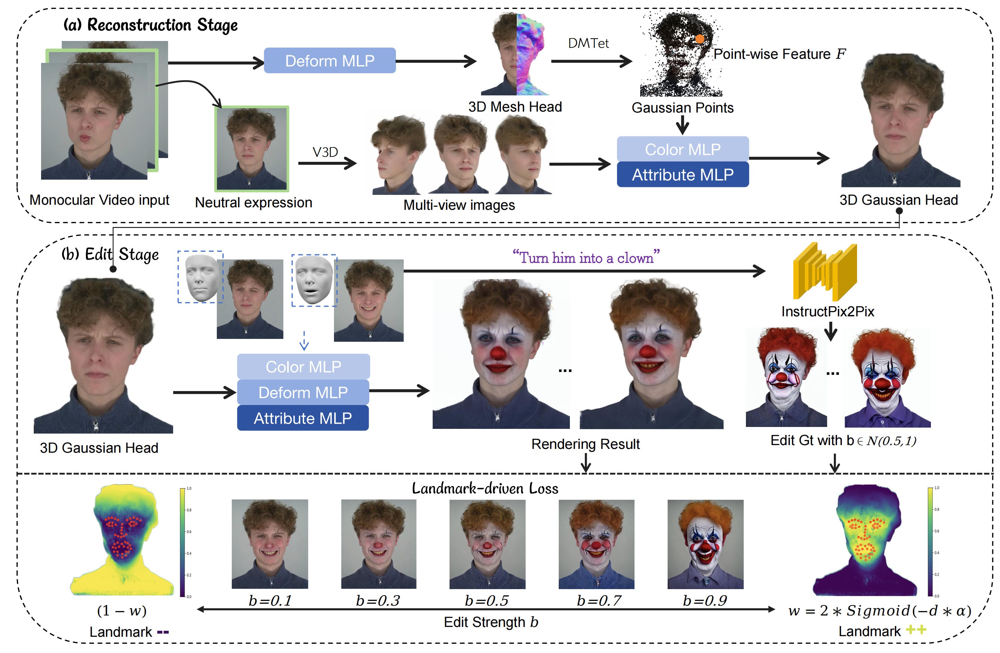

<div align="center">

# StyleTalker: Stylized Talking Head Avatar from Monocular Video
  
<a href="https://github.com/yxt7979">Xueting Yang</a><sup>†</sup>,
<a href="https://yukangcao.github.io/">Yukang Cao</a><sup>†</sup>,
<a href="">Junli Deng</a>,
<a href="https://zhaoxinf.github.io/">Zhaoxin Fan</a>,
<a href="https://www.kaihan.org/">Kai Han</a><sup>\*</sup>,
<a href="https://i.cs.hku.hk/~kykwong/">Kwan-Yee K. Wong</a><sup>\*</sup>,


[](https://github.com/yxt7979/Style-Talker)
<a href="https://github.com/yxt7979/Style-Talker"></a>


  
Please refer to our webpage for more visualizations.
</div>

## Abstract
We introduce **StyleTalker**, a text-guided method for editing and animating dynamic 3D head avatars from a monocular video. Current 3D scene editing techniques face two main challenges when applied in this task:
    1) They typically require multi-view videos for accurate geometry reconstruction. Additionally, they are not suited for dynamic scenarios, making them ineffective for editing talking head avatars from a single-view video.
    2) They struggle with fine-grained local edits, largely due to biases inherited from pre-trained 2D image diffusion models and limitations in detecting detailed facial landmarks.
    To overcome these challenges, we propose StyleTalker with two key innovations:
    1) A **mesh-enhanced 3D Gaussian reconstruction** that combines 3D head priors with multi-view video diffusion, improving the accuracy and flexibility of the reconstruction process.
    2) A **landmark-driven talking head editing** method that uses 3D facial landmarks to guide the editing process. By adjusting the strength of the edits based on the distance to these landmarks, our method ensures that the avatar's original identity is preserved while achieving the requested editing.
    Our extensive experiments demonstrate that \OMO outperforms current state-of-the-art methods, delivering high-quality edits and enabling the animation of avatars with diverse facial expressions, all based on a single-source video.
## Pipeline
StyleTalker takes as input a monocular video and text prompts to edit dynamic 3D scenes represented by 3D Gaussian splitting. **(1)** we first integrate both 3D head prior and multi-view video diffusion model (V3D) to reconstruct the detailed 3D Gaussian head. **(2)** We propose a weighted loss related to edit strength $b$ and the 3D facial landmarks, effectively achieve local editing while maintaining the original character identity.



## Code
We are working on releasing the code... 🏗️ 🚧 🔨 Please stay tuned!

## Misc.
If you want to cite our work, please use the following bib entry:
```

```
